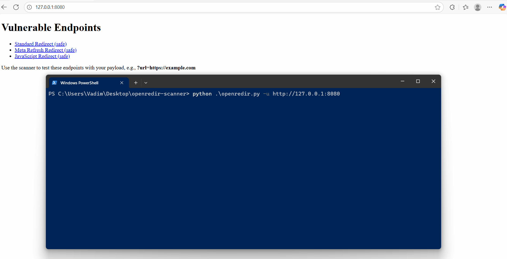

<p align="center">
  
</p>

# ReddeZeress - Advanced Open Redirect Scanner


ReddeZeress is a powerful, dual-phase scanner designed to discover Open Redirect vulnerabilities. It combines rapid static analysis with deep, browser-based dynamic analysis to uncover complex redirects in modern web applications.

## Key Features

-   **Dual-Phase Scanning:** Quickly finds simple redirects (static) and deeply analyzes JavaScript to find complex ones (DOM).
-   **Automatic Target Discovery:** Actively crawls the target website to discover endpoints and parameters for testing.
-   **Advanced DOM Analysis:** Utilizes JavaScript hook injection to intercept and log browser navigations, catching even the most sophisticated redirects.
-   **Asynchronous & Fast:** Built with asyncio and multithreading for high-speed scanning.
-   **Safe & Isolated:** Uses virtual environments to ensure it doesn't conflict with your system's packages.

## Demo



## Installation

For a stable and conflict-free experience, it is **highly recommended** to use a Python virtual environment (`venv`). This is **mandatory** on modern Linux distributions like Kali Linux to prevent system package conflicts.

1.  **Clone the repository:**
    ```bash
    git clone https://github.com/XATELO/openredir-scanner.git
    cd openredir-scanner
    ```

2.  **(Recommended) Create and activate a virtual environment:**
    *   **On Linux/macOS:**
        ```bash
        python3 -m venv venv
        source venv/bin/activate
        ```
    *   **On Windows (PowerShell):**
        ```powershell
        python -m venv venv
        .\venv\Scripts\Activate.ps1
        ```

3.  **Install dependencies:**
    *(Run this command inside the activated virtual environment for maximum compatibility)*
    ```bash
    pip install -r requirements.txt
    ```

4.  **Install Playwright browsers:**
    (This is a one-time setup to download the browsers needed for DOM analysis)
    ```bash
    playwright install
    ```

## Usage

**Important:** If you used a virtual environment, you must activate it first in your terminal session before running the scanner.

*   **On Linux/macOS:** `source venv/bin/activate`
*   **On Windows:** `.\venv\Scripts\Activate.ps1`

---

**Scan a single URL:**
```bash
python openredir.py -u https://target.com
```

**Scan a list of URLs from a file:**
```bash
python openredir.py -L targets.txt
```

**Provide a custom redirect destination payload:**
```bash
python openredir.py -u https://target.com --dest https://evil.com
```

**Deactivating the environment:**
When you are finished, you can exit the virtual environment by simply running:
```bash
deactivate
```
### Command-line Options

All available flags for `openredir.py`:
usage: openredir.py [-h] (-u URL | -L LIST) [--dest DEST] [-t TIMEOUT] [-T THREADS] [--ua UA] [--dom-workers DOM_WORKERS] [--max-pages MAX_PAGES]

ReddeZeress - Open Redirect Scanner
options:
-h, --help show this help message and exit

Target Specification:
-u URL, --url URL Single URL to scan.
-L LIST, --list LIST File containing a list of URLs to scan.

Scan Configuration:
--dest DEST Custom destination URL for redirect payloads (default: https://example.com).
-t TIMEOUT, --timeout TIMEOUT
HTTP request timeout in seconds (default: 5.0).
-T THREADS, --threads THREADS
Number of threads for static scanning (default: 50).
--ua UA Custom User-Agent string (default: ReddeZeress (+security-testing)).

DOM Scanning:
--dom-workers DOM_WORKERS
Number of parallel browser workers for DOM scanning (default: 12).

Crawling:
--max-pages MAX_PAGES
Maximum number of pages to crawl per base URL (default: 25).


### License
This project is licensed under the MIT License - see the LICENSE file for details.

### ⚠️Disclaimer
This tool is intended for educational and authorized penetration testing purposes only. The author is not responsible for any misuse or damage caused by this script.

### ❤️ Support the Project
This project is developed and maintained in my free time. If you find ReddeZeress useful and want to support its future development, please consider a donation.

- **BTC:** 1FBAjyBGsEPJtx45wXNuZBdGwPBfBRbwbG
- **ETH/ERC20:** 0x175d64ea78e5ada428f7df24985ba8d311375fae